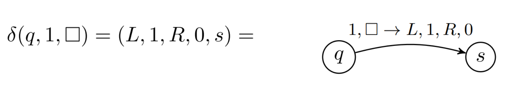
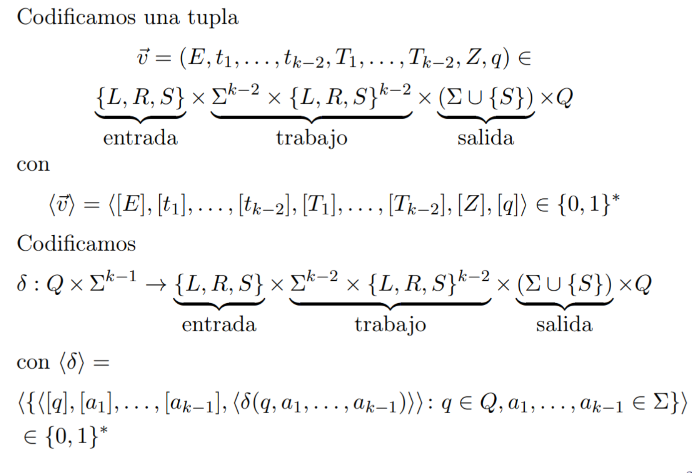

# Clase 2

18-03

## Funciones

### Funciones computables

Sea $f: \Gamma^* \rightarrow \Gamma^*$ y $M = (\Gamma', Q, \delta)$. Decimos que $M$ computa a $f$ si para todo $x \in \Gamma^*$ existe un computo $C_0, ..., C_l$ de $M$ a partir de $x$ y en $C_l$ la cinta de salida tiene escrito $f(x)$ seguido de blancos. Notamos $M(x)=f(x)$ en este caso.

- $f$ es computable si existe una máquina que la computa.

**Observacion:**
Podemos representar a las máquinas como autómatas:
- Los nodos del automata son los estados
- Las transiciones se representan como flechas (una flecha puede tener como detalle esto: $1,□ \rightarrow L, 1, R, 0$)

Para una funcion $f$ computable, existen infinitas máquinas que la computan.

### Funciones parciales
Es una funcion que puede indefinirse en algunos puntos.

- $f(x) \uparrow $ si se indefine
- $f(x) \downarrow $ si se define

$Dom(f) = \{ x: f(x) \downarrow \}$

Notamos a las funciones parciales como $f : \subset \Gamma \rightarrow \Gamma$.

En general, como las maquinas pueden colgarse, van a computar funciones parciales.

#### Parcialmente computable
Sea $f : \subset \Gamma \rightarrow \Gamma$ y  $M = (\Gamma', Q, \delta)$. M computa a $f$ si para todo $x \in \Gamma^*$:
- $f(x) \downarrow \implies \exists C_0, ..., C_l$ de $M$ a partir de $x$ y en $C_l$ la cinta de salida tiene escrito $f(x)$ segudo de blancos. Decimos $M(x) \downarrow$.
- $f(x) \uparrow \implies \exists C_0, C_1, ...$ secuencia infinita de condifuraciones tal que $C_0$ es inicial y no hay computo de $M$ a partir de $x$. Se cuelga.

$f$ es parcial computable si existe una máquina que la computa.

### Funciones parciales vs computables
Una funcion (estandar/total) es un mapeo de toda entrada a toda salida. 

Una funcion parcial es un mapeo posiblemnte incompleto. 

## Tiempo de cómputo

Tamaño de entrada: Sea $x\in \Gamma^*$, el tamaño es $|x|=|[x]|$.

Sea $f: \Gamma^* \rightarrow \Gamma^*$, $\mathbb{T}: \mathbb{N} \rightarrow \mathbb{N}$ y $M$ una máquina:

- $M$ corre en tiempo $T(n)$ si para todo $x \in \Gamma^*$ hay un computo de $M$ a partir de $x$ de longitud $\leq T(|x|)$ ($M$ no se cuelga nunca).
- $M$ computa $f$ en tiempo $T(n)$ si corre en tiempo $T(n)$ y $M$ computa a $f$.

### Notación $O$
Sea $f,g :\mathbb{N} \rightarrow \mathbb{N}$. Decimos $f = O(g)$ si existe $c$ tal que para todo $n$ suficientemente grande tenemos $f(n) \leq c g(n)$

- $M$ corre en tiempo $O(T(n))$ si existe una constante $c$ tal que $\forall x\in \Gamma^*$, salvo finitos, existe un computo de $M$ a partir de $x$ de longitud a lo sumo $c*T(|x|)$
- $M$ corre en tiempo poliniomial si existe un polinomio $p$ tal que $M$ corre en tiempo $O(p)$.

**Observacion**

Un lenguaje $L$ es decidible en tiempo $T(n)$, $O(T(n))$, polinomial, si $x_L$ es computable en tiempo $T(n), O(T(n)),$ polinomial.

### Multiples parámetros

Se puede codificar la entrada con:
- Concatenando usando simbolos distinguidos: $▷σ□τ□□□$.
- Usando codificaciones autodelimitantes sobre $\{0,1\}^*$ (ELEGIDA)

### Funciones construibles
Una funcion $T: \mathbb{N} \rightarrow \mathbb{N}$ es construible en tiempo si:
- $T(n) \geq n$
- La funciona $1^n \rightarrow [T(n)]$ es computable en tiempo $O(T(n))$

## Codificacion de máquinas $\langle M \rangle$
Numeramos los estados de $Q$ desde $0$ hasta $|Q|-1$ y representamos cada estado $n$ con $[n]$.
Reservamos el 0 para $q_0$ y el 1 para $q_f$.

Codificamos cada simbolo de $\Sigma \cup \{L,R,S\}$ con:
- [0]=000
- [1]=001
- [□]=010
- [▷]=011
- [L]=100
- [R]=101
- [S]=110

Codificacion de $\delta$

### Maquinas y palabras en binario.
- Toda palabra $x \in \{0,1\}^*$ representa alguna máquina.
- Identificamos máquinas con palabras: La maquina $x$ o la x-esima máquina refiere a la unica máquina tal que $\langle M \rangle = x$.
- Toda maquina representa una funcion parcial.
- Toda funcion parcial tiene infinitas maquinas que la computan-
- Toda funcion parcial se codifica con infinitas palabras.

### Numerables ($\neq$ finito)
- Hay una cantidad numerable de máquinas.
- Hay una cantidad numerable de funciones computables.
- Hay una cantidad no numerable de funciones.
- Por lo tanto hay funciones no computables.

## Variantes de máquinas

### Maquinas sobre alfabetos no estandar
Sea $\Gamma$ un alfabeto. Si $f$ es computable en tiempo $T(n)$ por una máquina $M=(\Gamma, Q, \delta)$ entonces $f$ es computable en tiempo $O(log |\Gamma| * T(n))$ por una máquina $M'=(\{0,1,▷, □\}, Q', \delta')$.

### Maquinas de cinta única
Tienen una unica cinta con cabeza de lectura y escritura. Su funcion de transicion es $\delta: Q \times \Sigma \rightarrow \Sigma \times \{L,R,S\} \times Q$.

**Prop:** Si $f$ es computable en $T(n)$ or una maquina estandar ($k \geq 3$ cintas) entonces es computable en tiempo $O(T(n)^2)$ por una maquina de cinta unica.

### Maquinas Oblivious
Una máquina es oblivious si para cada entrada $x$ y cada $i \in \mathbb{N}$:
- La posicion de las cabezas de la cintas de entrada y trabajo en el iesimo paso solo depende de $i$ y de $|x|$ pero no de $x$.
- Las funciones que computan esas posiciones a partir de $i, |x|$ son computables en tiempo polinomial.

**Prop**: Si $f$ es computable en tiempo $T(n)$ por una máquina estandar entonces hay una máquina oblivious que computa $f$ en tiempo $O(T(n)^2)$

### Maquinas con cintas bi-infinitas

Tienen cintas infinitas en ambas direcciones en lugar de solo hacia la derecha.

**Prop**: Si $f$ es computable por una maquina con cintas bi-infinitas en tiempo $T(n)$ entonces es computable por una maquina estandar en tiempo $O(T(n))$.